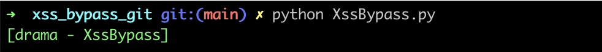
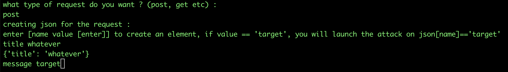
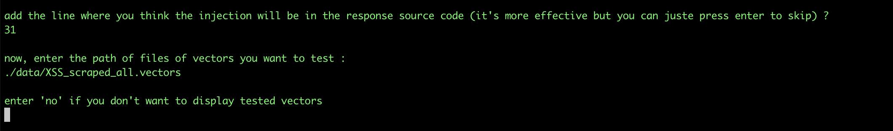

# XSS_bypass

Welcome to my XssBypass class.

You can use it as a program or a class.

use the following command to launch it as a program and then follow the input interaction

here is an example.
We are gonna use the rootme exercice called XSS.stored.filter.bypass

after choosing between a post or a get request, you have to create your json as the folowing example.
the 'target' value is gonna be the value we want to attack.

to be more precise, you can add the line number where your injection will be checked. in our case, the line 
number is 31.

Now you just have to enter the path of your file, enter an empty line to end your selection
then press enter to launch the programm and display the vectors tested or 'no' to launch the file without 
showing the vectors tested.

all the solution will be stored in you data file, 
for exemple if i have tested a ./data/vectors
my result will be on ./data/vectors_results.txt
